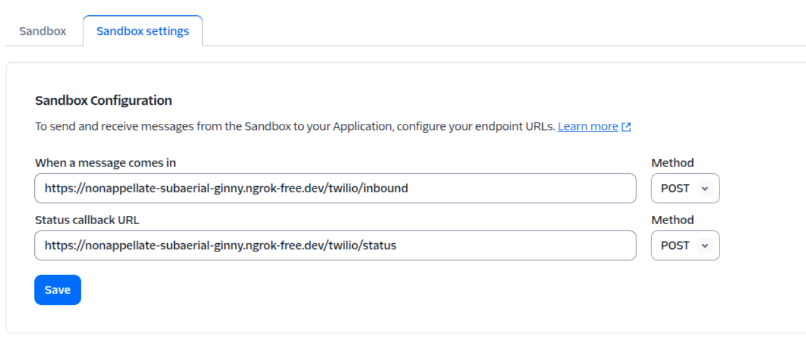

# Event-Driven Messaging Platform

An event-driven messaging platform for sending personalized WhatsApp messages using Twilio and Flask. This application listens for incoming events and triggers corresponding actions, such as sending tailored messages to users.
It includes a full API for managing users, templates, segments, and campaigns, as well as a minimal web UI for easy interaction.

## Features

- Receive incoming WhatsApp messages.
- Process messages in an event-driven manner.
- Send personalized outgoing WhatsApp messages.
- Full REST API for managing:
  - Users
  - Templates
  - Segments
  - Campaigns
- Data ingestion for users (CSV/JSON) and events (JSONL).
- Manual and event-driven campaign orchestration.
- Webhook support for real-time message and status updates.
- Minimal web UI for platform management.

## Tech Stack

- **Backend:** Python, Flask
- **Messaging:** Twilio API for WhatsApp
- **Development:** ngrok

## Prerequisites

Before you begin, ensure you have the following installed:
- [Python 3.8+](https://www.python.org/downloads/)
- [pip](https://pip.pypa.io/en/stable/installation/)
- [ngrok](https://ngrok.com/download)
- A [Twilio account](https://www.twilio.com/try-twilio) with a configured WhatsApp Sandbox.

## Installation

1.  **Clone the repository:**
    ```bash
    git clone <your-repository-url>
    cd event-driven-messaging-platform
    ```

2.  **Create and activate a virtual environment:**
    ```bash
    # For macOS/Linux
    python3 -m venv venv
    source venv/bin/activate

    # For Windows
    python -m venv venv
    .\venv\Scripts\activate
    ```

3.  **Install dependencies:**
    ```bash
    pip install -r requirements.txt
    ```

4.  **Create Environment File:**
    Create a `.env` file in the root directory of the project and add your Twilio credentials.
    ```
    TWILIO_ACCOUNT_SID=ACxxxxxxxxxxxxxxxxxxxxxxxxxxxxx
    TWILIO_AUTH_TOKEN=your_auth_token
    TWILIO_WHATSAPP_NUMBER=whatsapp:+14155238886
    ```

## Configuration

1.  **Set up local tunneling with ngrok:**
    To allow Twilio to send requests to your local Flask application, you need to expose your local server to the internet.
    ```bash
    ngrok http 5000
    ```
    Note down the `https` Forwarding URL provided by ngrok (e.g., `https://<random-string>.ngrok.io`).

2.  **Configure Twilio Sandbox:**
    - Go to your Twilio Console and navigate to the WhatsApp Sandbox settings.
    - In the "WHEN A MESSAGE COMES IN" field, paste your ngrok URL followed by the webhook endpoint (e.g., `https://<random-string>.ngrok.io/twilio/inbound`).
    - You can use the same URL for the "STATUS CALLBACK URL" to receive message status updates.



## Usage

1.  **Run the Flask application:**
    ```bash
    flask run
    ```

2.  **API Documentation (Development Mode):**
    When running in development mode, you can access the Swagger UI for API documentation and testing at: http://127.0.0.1:5000/apidocs/

3.  **Web Interface:**
    A minimal web UI is available to manage the platform at: http://127.0.0.1:5000/ui/
    From here, you can upload users, create templates and segments, define campaigns, and trigger them.

## Running Tests

This project uses `pytest` for unit and integration testing. The tests cover data model validation and an end-to-end workflow simulation from event ingestion to message status callback.

1.  **Install Test Dependencies:**
    The required testing libraries (`pytest`, `pytest-mock`, `mongomock`) are included in `requirements.txt`. If you haven't already, install them:
    ```bash
    pip install -r requirements.txt
    ```

2.  **Execute Tests:**
    To run the full test suite, navigate to the project's root directory and execute:
    ```bash
    pytest
    ```

### Additional Test Commands

-   **Run in Verbose Mode:**
    To see a detailed output with the name of each test function:
    ```bash
    pytest -v
    ```

-   **Run a Specific Test File:**
    To run only the unit tests for the data models:
    ```bash
    pytest test_models.py
    ```

-   **Run Tests by Keyword:**
    To run a specific test by matching a keyword in its name (e.g., the end-to-end test):
    ```bash
    pytest -k "test_e2e"
    ```
